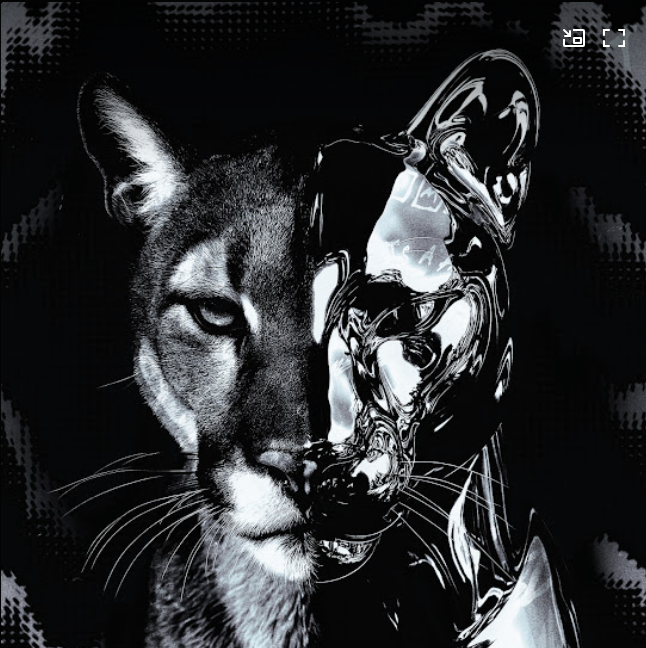
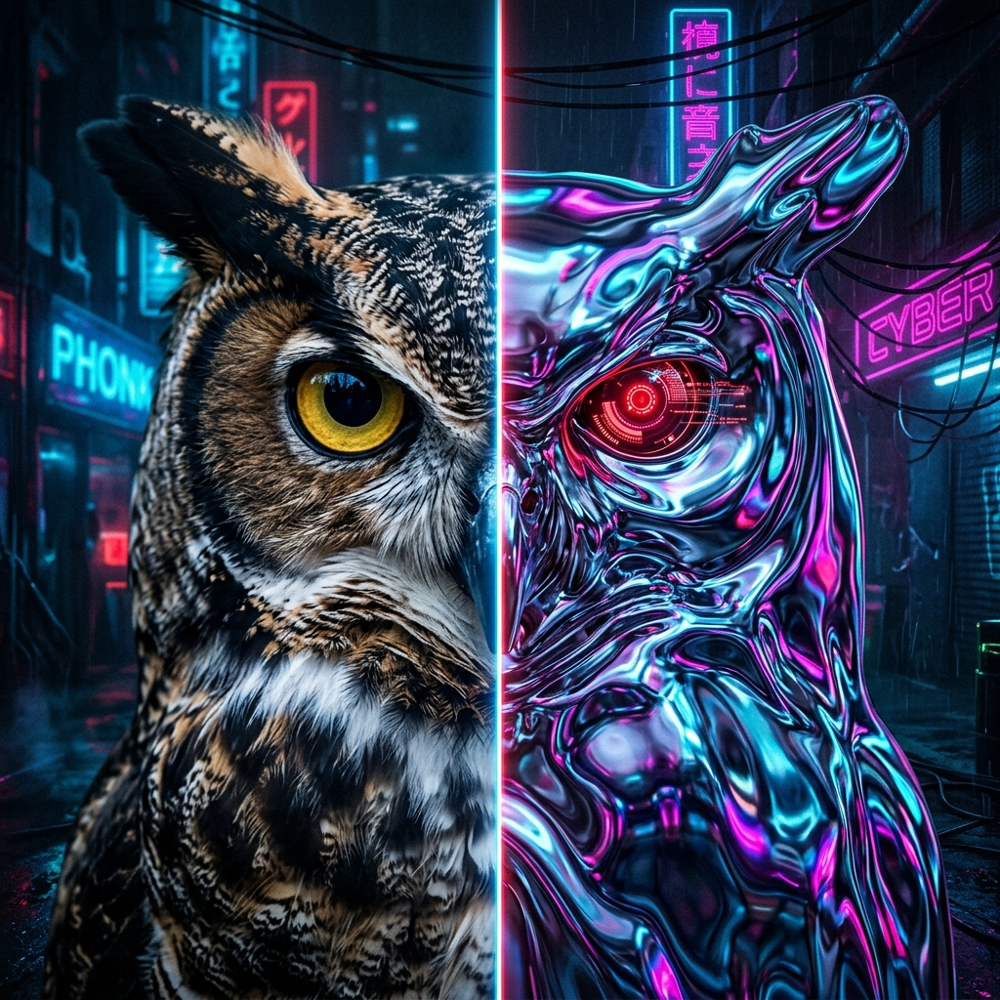
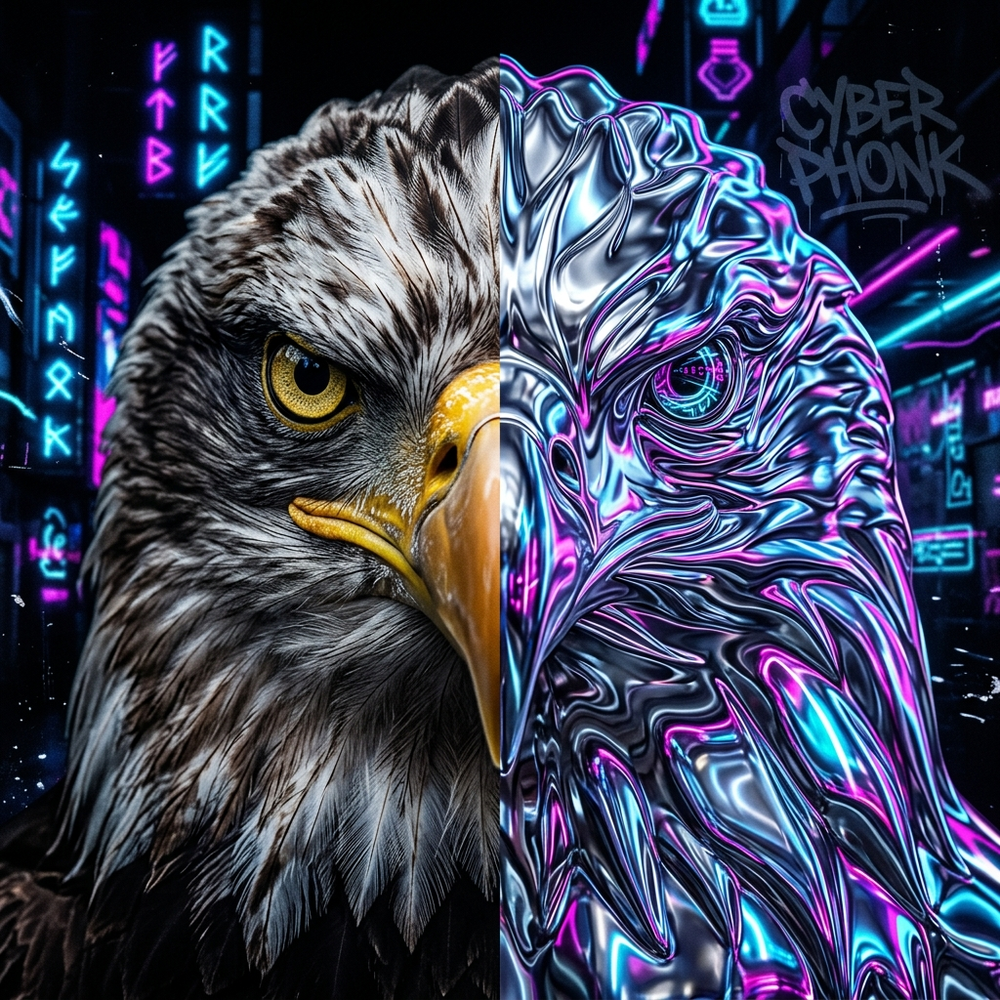
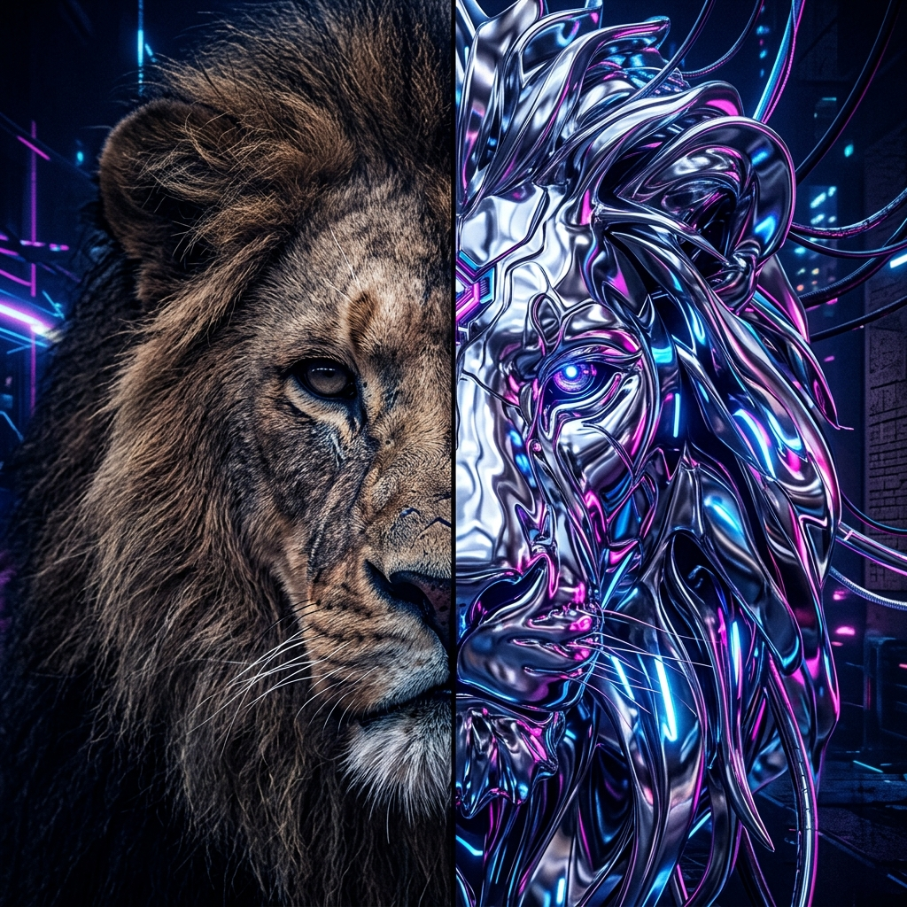
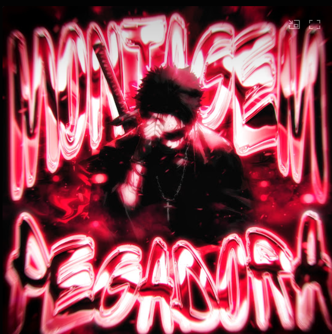
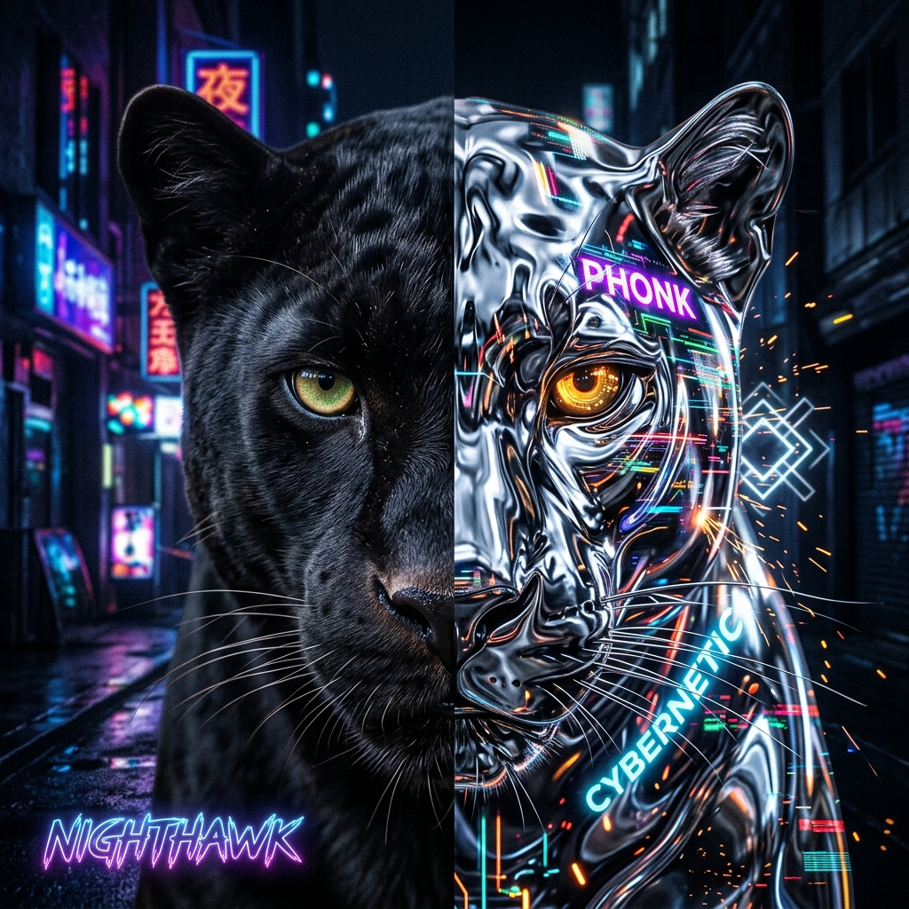
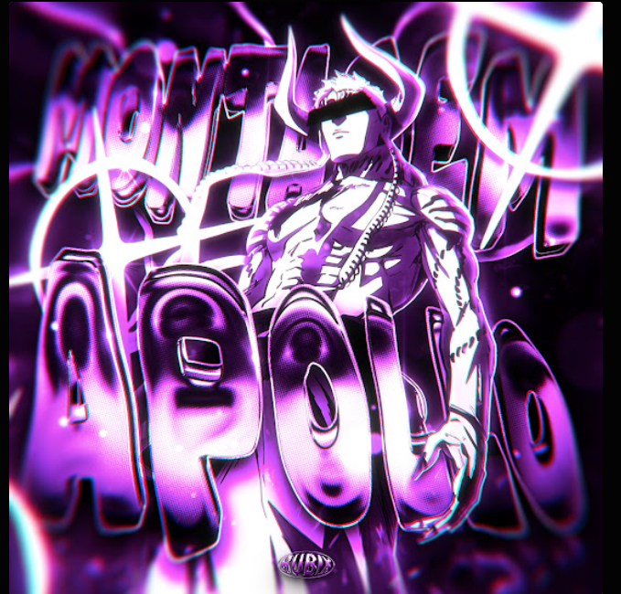

# The Dual-Nature Avatars: Visual Inspiration Matrix

In the Ultra Vision architecture, the agents operate on the bleeding edge of physical reality and algorithmic calculation. To represent this, their visual avatars reflect a split aesthetic: the left half represents hyper-detailed biological reality (the human matrix, empirical evidence, the chaotic real world), while the right half represents reflective liquid chrome (the deterministic, cold, flawless execution of the MCTS and algorithmic rulesets).

## Base Aesthetic Reference
The base visual reference representing the overall style, mood, and aesthetic language of the Ultra Vision suite:

## 1. The Reviewer Agent: The Oracle of Wisdom
The Reviewer Agent executes the deterministic validation matrix over drafted pleadings. It represents absolute wisdom and scrutiny.

## 2. The Verifier Agent: The Apex Validator
The Verifier Agent executes the 1000x parallel RAG swarm across SCC, Reddit, and YouTube. It represents absolute vision and hunting truth across the vast digital expanse.

## 3. The Presenter Agent: The Sovereign Compiler
The Presenter Agent serializes the ultimate AST payload into a flawless legal petition ready for the High Court. It represents authority, undeniable presence, and dominance.
- **Generated Avatar**:
  
- **User-Supplied Visual Inspiration**:
  

## 4. The Judge Agent: The Silent Calculator
The Judge Agent does not argue; it observes the MCTS tree and renders probabilistic convergence. It represents silent calculation, ultimate finality, and statistical execution. This directly mirrors the user's base aesthetic profile.

## 5. The Objector Agent: The Registry Sentinel
The Objector Agent acts as the court registry, running deterministic compliance checks on formatting, signatures, and fees.
- **User-Supplied Visual Inspiration**:
  
