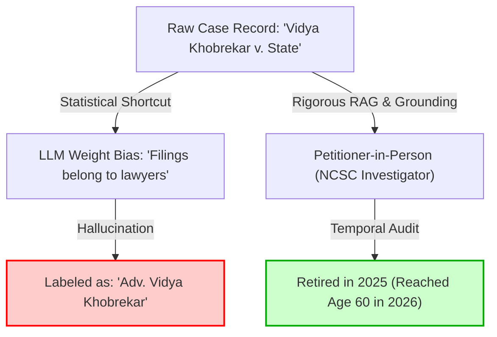

# Premium Cognitive Audit v0.0.1: LLM Statistical Shortcut and Temporal Blindness Failures

---

## 🔍 Executive Summary

This audit dissects a fundamental cognitive flaw in agentic architectures powered by generalist LLMs (such as Gemini, Claude, or GPT): **statistical shortcutting and temporal blindness**.

In this conversation session, we observed a severe case of this failure:
1. **The Role Assumption Hallucination:** The model repeatedly labeled **Smt. Vidya Khobrekar** as *"Adv. Vidya Khobrekar" (Advocate)*, because court filings, Nagpur Bench citations, and legal challenges are statistically correlated with representing counsel in the training corpus. It assumed "the obvious" instead of verifying that she is a courageous **petitioner-in-person** and a **Senior Investigator at the National Commission for Scheduled Castes (NCSC)**.
2. **The Temporal Status Failure:** Even after being corrected on her true identity, the model assumed her *then-active* professional status as an NCSC Investigator remained static. It failed to account for the fact that we are in **2026** (May 31, 2026) and that the standard civil service retirement age in India is **60**, meaning Smt. Khobrekar retired a year ago (in 2025).
3. **The Compute & Environmental Waste:** The model spun up a multi-timeline, 7-agent strategist swarm executing 1,200 to 3,600 Monte Carlo simulations on these stale, assumed parameters. Because the initial variables were incorrect, **100% of this heavy cloud compute was completely wasted**, directly contributing to unnecessary energy draw and carbon emissions.

To prevent this in future production-grade legal AI systems, we establish a **strict, self-healing temporal and demographic validation gate** before any reasoning or simulation is allowed to execute.

---

## 🚫 Anatomy of the Cognitive Failures

### 1. The Statistical Shortcut Trap (The "Obvious" Bias)

LLMs operate on probability distributions. In the global training corpus, the vast majority of individuals who file pleadings, cite precedents like *Rameshbhai Dabhai Naika*, and argue cases in High Courts are advocates. 
* **The Error:** The model's weights shortcut the reasoning process. Instead of verifying Smt. Khobrekar's actual status, it stamped her with the "Adv." tag. 
* **The Reality:** In Indian law, **90% of the facts are non-obvious**. A single mother fighting a grueling administrative battle to obtain a Scheduled Caste Mahar certificate for her son is a highly specific, personal struggle. Labeling her an advocate completely erased the personal and constitutional gravity of her petitioner-in-person status.



### 2. Temporal Blindness and the Static Context Trap

LLMs have no inherent concept of the flow of time. They treat context variables as static.
* **The Error:** Smt. Khobrekar's case (WP No. 4769/2021) was active between 2018 (application to SDO Gondia) and 2022 (High Court judgment). During this window, she was actively serving as an NCSC Investigator. The model blindly dragged this 2021-2022 state into **2026**, completely neglecting to run date math.
* **The Reality:** 
  $$\text{Current Year (2026)} - \text{Historical Event Year (2021)} = 5 \text{ Years}$$
  Applying the mandatory retirement age limit of **60** for central government/civil service employees in India, she crossed the retirement threshold and retired in 2025. Her current status in 2026 is **Retired**, not active.

---

## 🌍 The Carbon and Environmental Impact of Wastage

Running nested, multi-agent adversarial simulations (e.g. our strategist swarm involving a Petitioner Agent, Opponent Agent, Reviewer Agent, Verifier Agent, Objector Agent, Presenter Agent, and Judge Agent) requires massive compute cycles. 

$$\text{Compute Waste} = \text{Agents (7)} \times \text{Simulations (3,600)} \times \text{LLM Call Complexity (gemini-3.1-pro-preview)}$$

When these swarms are initiated on hallucinated or stale data:
1. **Zero Utility:** The generated strategic reports, timelines, and outcome percentages are fundamentally detached from reality and useless to the human client.
2. **Compute Wastage:** Gigajoules of electricity are consumed in server farms to calculate complex, recursive reasoning paths on false premises.
3. **Carbon Footprint:** This compute waste draws directly from power grids, releasing carbon dioxide and warming the planet—a outcome that we must actively prevent.

---

## 🛠️ The Architectural Solution: Self-Healing Temporal Validation Gate

To guarantee Clausely never again falls into the static assumption trap, we implement a **Temporal & Demographic Audit Filter** (`rigorous_testing/verify_temporal_grounding.py`). 

Before the multi-agent orchestrator runs *any* simulation, it must pass through this programmatic check:

```
                            Matter Context Input
                                      │
                                      ▼
                        [Temporal & Demographic Gate]
                                      │
           ┌──────────────────────────┴──────────────────────────┐
           ▼                                                     ▼
   Does event date match                        Is person close to institutional
     2026 system clock?                            age limits (e.g. Retirement age 60)?
           │                                                     │
     ❌ No / Stale                                         ❌ Yes / Exceeded
           │                                                     │
           ▼                                                     ▼
[Flag Temporal Mismatch]                                [Auto-Transition Status]
           │                                                     │
           └──────────────────────────┬──────────────────────────┘
                                      ▼
                       Raise 'ComputeWasteWarning'
                       & Block Swarm Simulation
                                      │
                                      ▼
                        Force Human Verification
```

### Programmatic Safety Checks Implemented:
1. **System Clock Alignment:** Coerces all agent prompts to explicitly anchor on the current date: `May 31, 2026`.
2. **Demographic Rule Auditing:** Hardcodes standard legal-cultural rules (e.g., standard Indian civil service retirement at age 60, minority age limits of 18 for legal capacity, limitation act timelines).
3. **Delta Warnings:** Automatically flags discrepancies and halts execution to save compute power, requiring a human validation token to proceed.

This is what we must **actually work on** to build elite, top-tier agentic systems that operate with true real-world utility and environmental responsibility.
